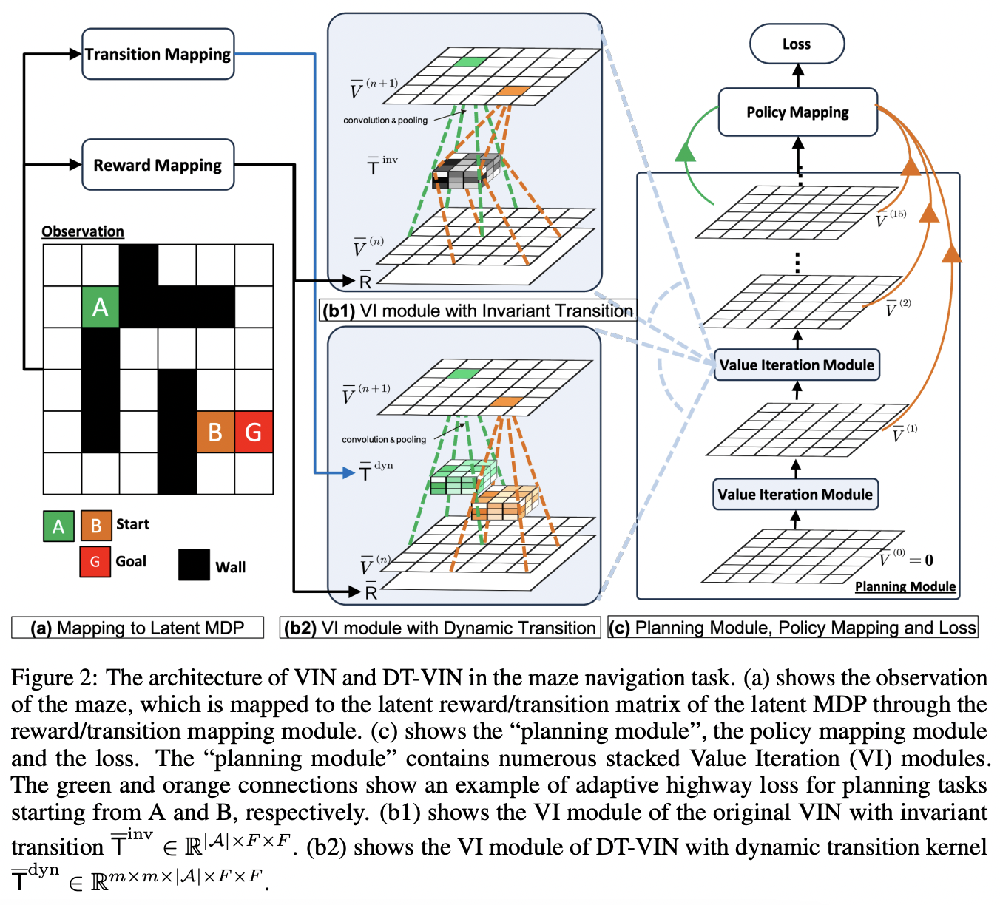

</img>

## Scaling Value Iteration Networks (wip)

Exploration into the <a href="https://arxiv.org/abs/2406.08404">Scaling Value Iteration Networks</a> paper, from Schmidhuber's group

## Usage

```python
import torch
from scaling_vin_pytorch import ScalableVIN

scalable_vin = ScalableVIN(
    state_dim = 3,
    reward_dim = 2,
    num_actions = 10
)

state = torch.randn(2, 3, 32, 32)
reward = torch.randn(2, 2, 32, 32)

agent_positions = torch.randint(0, 32, (2, 2))

target_actions = torch.randint(0, 10, (2,))

loss = scalable_vin(
    state,
    reward,
    agent_positions,
    target_actions
)

loss.backward()

action_logits = scalable_vin(
    state,
    reward,
    agent_positions
)
```

## Citations

```bibtex
@article{Wang2024ScalingVI,
    title   = {Scaling Value Iteration Networks to 5000 Layers for Extreme Long-Term Planning},
    author  = {Yuhui Wang and Qingyuan Wu and Weida Li and Dylan R. Ashley and Francesco Faccio and Chao Huang and J{\"u}rgen Schmidhuber},
    journal = {ArXiv},
    year    = {2024},
    volume  = {abs/2406.08404},
    url     = {https://api.semanticscholar.org/CorpusID:270391752}
}
```

```bibtex
@misc{pflueger2018soft,
    title   = {Soft Value Iteration Networks for Planetary Rover Path Planning},
    author  = {Max Pflueger and Ali Agha and Gaurav S. Sukhatme},
    year    = {2018},
    url     = {https://openreview.net/forum?id=Sktm4zWRb},
}
```

```bibtex
@inproceedings{Tamar2016ValueIN,
    title   = {Value Iteration Networks},
    author  = {Aviv Tamar and Sergey Levine and P. Abbeel and Yi Wu and Garrett Thomas},
    booktitle = {Neural Information Processing Systems},
    year    = {2016},
    url     = {https://api.semanticscholar.org/CorpusID:11374605}
}
```
